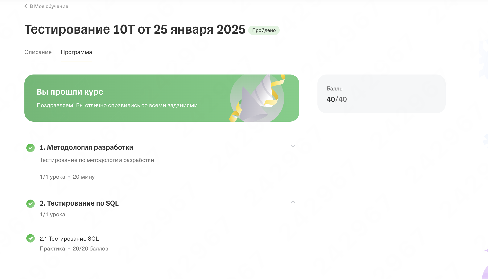

# Домашняя работа: Индивидуальный и Командный проект DDL
Гладышев Даниил 10 Т 
## Индивидуальный Проект

### Структура Базы Данных

#### Таблица `users`
```sql
-- Пользователи
CREATE TABLE users (
  id SERIAL PRIMARY KEY,
  login VARCHAR(255) NOT NULL UNIQUE,
  password VARCHAR(255) NOT NULL,
  token VARCHAR(255) NOT NULL,
  firstname VARCHAR(255),
  lastname VARCHAR(255),
  age INT CHECK (age > 0),
  gender VARCHAR(6) CHECK (gender IN ('Male', 'Female'))
);
-- Реакции
CREATE TABLE reactions (
  id SERIAL PRIMARY KEY,
  user_id BIGINT NOT NULL,
  type VARCHAR(255) NOT NULL,
  FOREIGN KEY (user_id) REFERENCES users(id) ON DELETE CASCADE
);
-- Индексы для поиска
CREATE INDEX idx_reactions_user_id ON reactions(user_id);
```


## Командный Проект

### Описание
Проектом будет являться телеграмм бот "афиша" с возможностью просмотром интересных мест и напоминанием о мероприятиях

### Структура Базы Данных


```sql
-- Пользователи
CREATE TABLE users (
  id SERIAL PRIMARY KEY,
  username VARCHAR(255) NOT NULL UNIQUE,
  password VARCHAR(255) NOT NULL,
  email VARCHAR(255) UNIQUE,
  firstname VARCHAR(255),
  lastname VARCHAR(255),
  created_at TIMESTAMP DEFAULT CURRENT_TIMESTAMP
);

-- Мероприятия
CREATE TABLE events (
  id SERIAL PRIMARY KEY,
  title VARCHAR(255) NOT NULL,
  description TEXT,
  event_date TIMESTAMP NOT NULL,
  location VARCHAR(255),
  organizer VARCHAR(255),
  created_at TIMESTAMP DEFAULT CURRENT_TIMESTAMP
);

-- Артисты
CREATE TABLE artists (
  id SERIAL PRIMARY KEY,
  name VARCHAR(255) NOT NULL,
  bio TEXT,
  genre VARCHAR(255),
  created_at TIMESTAMP DEFAULT CURRENT_TIMESTAMP
);
-- Избранные места
CREATE TABLE favorite_places (
  id SERIAL PRIMARY KEY,
  user_id BIGINT NOT NULL,
  place_name VARCHAR(255) NOT NULL,
  place_address VARCHAR(255),
  FOREIGN KEY (user_id) REFERENCES users(id) ON DELETE CASCADE
);

-- Избранные артисты
CREATE TABLE favorite_artists (
  id SERIAL PRIMARY KEY,
  user_id BIGINT NOT NULL,
  artist_id BIGINT NOT NULL,
  FOREIGN KEY (user_id) REFERENCES users(id) ON DELETE CASCADE,
  FOREIGN KEY (artist_id) REFERENCES artists(id) ON DELETE CASCADE
);

-- Посещенные мероприятия
CREATE TABLE attended_events (
  id SERIAL PRIMARY KEY,
  user_id BIGINT NOT NULL,
  event_id BIGINT NOT NULL,
  attendance_date TIMESTAMP DEFAULT CURRENT_TIMESTAMP,
  FOREIGN KEY (user_id) REFERENCES users(id) ON DELETE CASCADE,
  FOREIGN KEY (event_id) REFERENCES events(id) ON DELETE CASCADE
);

-- Мероприятия в "хочу пойти"
CREATE TABLE wishlisted_events (
  id SERIAL PRIMARY KEY,
  user_id BIGINT NOT NULL,
  event_id BIGINT NOT NULL,
  added_to_wishlist TIMESTAMP DEFAULT CURRENT_TIMESTAMP,
  FOREIGN KEY (user_id) REFERENCES users(id) ON DELETE CASCADE,
  FOREIGN KEY (event_id) REFERENCES events(id) ON DELETE CASCADE
);
```


